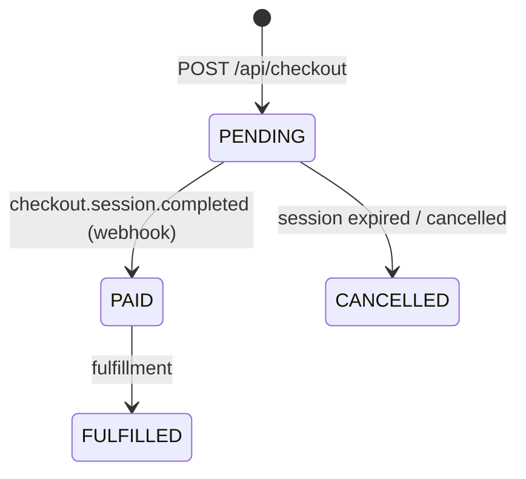

# SPEC: checkout

Date: 2026-07-30
Status: Implemented

## Purpose

Convert a cart into a paid order via Stripe hosted Checkout, with order
state driven only by webhooks so payment completion survives the user
closing the tab.

## Rich references

- Defining tests: `tests/money.test.ts` (cents invariant); webhook flow test
  pending — see Requirements 3-4.
- Mockups / artifacts: Stripe hosted page (no custom UI to mock).
- Rubric (for verification agents): an order is correct iff its `totalCents`
  equals the sum of `unitPriceCents * quantity` snapshots, and its status
  history only ever follows the state machine below.
- Order state machine (the invariant Requirements 3-4 protect):

## Requirements

1. POST `/api/checkout` creates a Checkout Session AND a PENDING order with
   price snapshots taken from the DB, never from the client payload.
2. All amounts are integer cents; any float in a money path is a bug.
3. `checkout.session.completed` (signature-verified) is the only code path
   that sets an order to PAID.
4. A replayed webhook event must be idempotent: re-processing the same
   session id never duplicates orders or double-updates status.

## Out of scope

- Refunds and partial fulfillment (future spec).
- Cart persistence across devices (cart is per-session).
- Non-Stripe payment providers.
